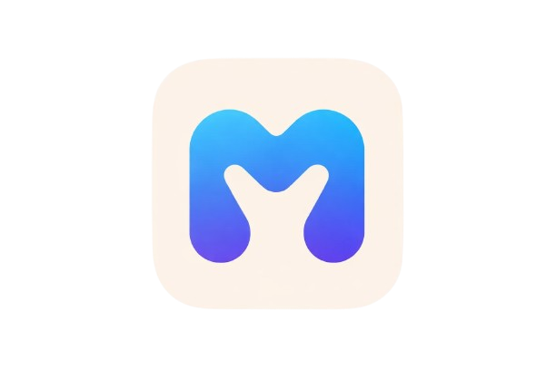

<p align="center">
  
</p>

<h1 align="center">MeetConnect</h1>
<p align="center">
  <strong>Real-time video conferencing with Google Calendar integration</strong>
</p>
<p align="center">
  
  
  
  
  
</p>

---

## 📋 Description

MeetConnect is a production-grade video conferencing platform built from scratch. Users can create instant meetings, schedule future sessions with Google Calendar sync, join via shareable codes, and communicate through real-time chat and emoji reactions — all through a premium, mobile-first responsive UI.

---

## ✨ Features

| Category | Features |
|----------|----------|
| **Video Conferencing** | Peer-to-peer WebRTC video/audio, multi-participant mesh, mic/camera toggle, screen sharing ready |
| **Meeting Management** | Instant room creation, scheduled meetings with attendees, meeting history tracking |
| **Google Calendar** | OAuth2 integration, auto-sync create/update/delete, calendar event links |
| **Authentication** | Email/password login, Google OAuth, JWT with HTTP-only cookies, brute-force protection |
| **Password Recovery** | 3-step OTP flow via email (request → verify → reset) |
| **Account Management** | Profile editing, password change, logout all devices (token versioning) |
| **Real-time Chat** | In-meeting messaging with sender avatars, timestamps, message history |
| **Emoji Reactions** | Live emoji overlay broadcast to all participants |
| **Security** | Rate limiting (Redis-backed), bcrypt hashing, encrypted OAuth tokens, CORS whitelist |
| **UI/UX** | Mobile-first responsive design, skeleton loading states, dark mode, micro-animations |

---

## 🛠 Tech Stack

### Frontend
- **React 19** — SPA with code-splitting (lazy loading)
- **Vite** — Fast build tool and dev server
- **Tailwind CSS 4** — Utility-first styling
- **WebRTC** — Native browser API for peer-to-peer media
- **Socket.IO Client** — Real-time signaling and chat

### Backend
- **Express 5** — REST API server
- **MongoDB + Mongoose 9** — Document database
- **Socket.IO** — WebSocket server for signaling
- **JWT + bcrypt** — Authentication and password hashing
- **Google APIs** — OAuth2 + Calendar API v3
- **Nodemailer** — Email delivery for OTP
- **Redis** — Rate limiting storage

---

## 📁 Folder Structure

```
MeetConnect/
├── backend/
│   ├── server.js                    # Entry point — Express + Socket.IO
│   ├── src/
│   │   ├── config/
│   │   │   └── db.js                # MongoDB connection
│   │   ├── controllers/
│   │   │   ├── auth.controllers.js  # Login, register, Google OAuth, password reset
│   │   │   ├── meeting.controllers.js # CRUD meetings, Google Calendar sync
│   │   │   ├── account.controllers.js # Profile update, password change
│   │   │   ├── history.controllers.js # Meeting history tracking
│   │   │   └── SocketManager.js     # Socket.IO signaling, room registry, chat
│   │   ├── middleware/
│   │   │   ├── auth.middleware.js    # JWT verification + token versioning
│   │   │   └── rateLimiter.middleware.js # Rate limiting (global + auth-specific)
│   │   ├── models/
│   │   │   ├── user.model.js        # User schema (auth, OTP, brute-force fields)
│   │   │   ├── meeting.model.js     # Meeting history schema
│   │   │   ├── scheduledMeeting.model.js # Scheduled meeting schema
│   │   │   └── oauthCredential.model.js # Encrypted Google OAuth tokens
│   │   ├── routes/
│   │   │   ├── users.routes.js      # Auth + history routes
│   │   │   ├── account.routes.js    # Profile + security routes
│   │   │   └── meeting.routes.js    # Meeting CRUD + calendar routes
│   │   ├── services/
│   │   │   ├── account.service.js   # Business logic for profile/password
│   │   │   ├── email.service.js     # Nodemailer OTP sender
│   │   │   └── googleCalendar.service.js # Google Calendar CRUD + token encryption
│   │   └── utils/
│   │       ├── authToken.js         # JWT sign/verify + cookie helpers
│   │       ├── userMapper.js        # Strip sensitive fields from user objects
│   │       ├── responses.js         # Standardized API response helpers
│   │       └── meeting.js           # Meeting code normalization
│   └── package.json
│
├── frontend/
│   ├── src/
│   │   ├── App.jsx                  # Router + code-splitting + route prefetch
│   │   ├── main.jsx                 # React entry point
│   │   ├── index.css                # Global styles + animations
│   │   ├── pages/
│   │   │   ├── Landing.jsx          # Marketing hero page
│   │   │   ├── Login.jsx            # Email/password + Google login
│   │   │   ├── SignupPage.jsx       # Registration form
│   │   │   ├── ForgotPassword.jsx   # 3-step OTP password recovery
│   │   │   ├── Dashboard.jsx        # Main hub — stats, actions, scheduled meetings
│   │   │   ├── VideoMeet.jsx        # Video call — lobby → meeting room
│   │   │   ├── History.jsx          # Meeting history list
│   │   │   ├── AccountSettings.jsx  # Profile + security settings
│   │   │   ├── ScheduleMeetingModal.jsx # Meeting scheduler with calendar toggle
│   │   │   ├── MeetRedirect.jsx     # /meet/:code → /videomeet?code=
│   │   │   └── TermsAndConditions.jsx
│   │   ├── components/
│   │   │   ├── Lobby.jsx            # Pre-join camera preview + back button
│   │   │   ├── Controls.jsx         # In-call control bar (mic, cam, chat, leave)
│   │   │   ├── ChatPanel.jsx        # In-meeting chat sidebar/fullscreen
│   │   │   ├── VideoGrid.jsx        # Responsive video tile layout
│   │   │   ├── LocalVideo.jsx       # Picture-in-picture self-view
│   │   │   ├── EmojiBar.jsx         # Emoji reaction picker
│   │   │   ├── EmojiOverlay.jsx     # Floating emoji animations
│   │   │   ├── ProtectedRoute.jsx   # Auth guard wrapper
│   │   │   ├── auth/AuthPageShell.jsx # Shared auth page layout
│   │   │   ├── common/Skeleton.jsx  # Unified loading skeleton system
│   │   │   ├── common/Toast.jsx     # Notification toast
│   │   │   └── dashboard/           # StatCard, ActionCard, JoinMeetingModal
│   │   ├── hooks/
│   │   │   ├── useWebRTC.js         # WebRTC peer connection management
│   │   │   ├── useMediaStream.js    # Camera/mic lifecycle with cleanup
│   │   │   ├── useChat.js           # Chat message state management
│   │   │   ├── useSocket.js         # Socket context consumer
│   │   │   ├── useRateLimit.js      # Client-side form rate limiting
│   │   │   └── useTimedToast.js     # Auto-dismissing toast helper
│   │   ├── contexts/
│   │   │   ├── AuthContext.jsx      # Auth state + actions provider
│   │   │   ├── AuthContextValue.js  # Context object (separate for HMR)
│   │   │   └── SocketContext.jsx    # Socket.IO instance provider
│   │   ├── services/
│   │   │   ├── api.js               # All REST API call definitions
│   │   │   ├── apiClient.js         # Axios-like fetch wrapper with auth
│   │   │   └── socket.service.js    # Socket.IO event helpers
│   │   ├── utils/
│   │   │   ├── validators.js        # Form validation (email, password, etc.)
│   │   │   ├── authStorage.js       # localStorage token/user cache
│   │   │   ├── mediaUtils.js        # Fallback stream creation
│   │   │   └── meetingUtils.js      # Meeting code generation helpers
│   │   └── config/
│   │       └── webrtc.config.js     # ICE server configuration
│   └── package.json
│
├── system-design.md                 # Architecture documentation (this project)
├── README.md                        # This file
└── LICENSE
```

---

## ⚙️ Installation

### Prerequisites
- Node.js ≥ 18
- MongoDB (Atlas or local)
- Redis (for rate limiting)
- Google Cloud Console project (for Calendar + OAuth)

### Clone & Install

```bash
git clone https://github.com/Joel112003/MeetConnect.git
cd MeetConnect

# Backend
cd backend
npm install

# Frontend
cd ../frontend
npm install
```

---

## 🔐 Environment Variables

Create `backend/.env`:

```env
# ── Server ──
PORT=8000
FRONTEND_URL=http://localhost:5173
CORS_ORIGINS=http://localhost:5173,http://127.0.0.1:5173
TRUST_PROXY=false

# ── Database ──
MONGO_URI=mongodb+srv://<user>:<pass>@cluster.mongodb.net/meetconnect

# ── JWT ──
JWT_SECRET=your-super-secret-key-min-32-chars
JWT_EXPIRES_IN=7d

# ── Google OAuth ──
GOOGLE_CLIENT_ID=your-google-client-id.apps.googleusercontent.com
GOOGLE_CLIENT_SECRET=your-google-client-secret
GOOGLE_REDIRECT_URI=http://localhost:8000/api/v1/meetings/google/callback

# ── Google Calendar Token Encryption ──
GOOGLE_TOKEN_ENCRYPTION_KEY=32-byte-hex-string

# ── Email (Nodemailer) ──
EMAIL_USER=your-email@gmail.com
EMAIL_PASS=your-app-password

# ── Redis ──
REDIS_URL=redis://localhost:6379
```

Create `frontend/.env`:

```env
VITE_API_URL=http://localhost:8000
VITE_GOOGLE_CLIENT_ID=your-google-client-id.apps.googleusercontent.com
```

---

## 🚀 How to Run

### Development

```bash
# Terminal 1 — Backend
cd backend
npm run test    # Uses nodemon for hot-reload

# Terminal 2 — Frontend
cd frontend
npm run dev     # Vite dev server on :5173
```

### Production

```bash
# Backend
cd backend
npm start       # Or: npm run prod (uses PM2)

# Frontend
cd frontend
npm run build   # Creates dist/ folder
npm run preview # Preview production build
```

---

## 📡 API Endpoints

### Authentication
| Method | Endpoint | Description |
|--------|----------|-------------|
| POST | `/api/v1/users/register` | Register new user |
| POST | `/api/v1/users/login` | Email/password login |
| POST | `/api/v1/users/google-login` | Google OAuth login |
| POST | `/api/v1/users/logout` | Logout (clear cookie) |
| POST | `/api/v1/users/forgot-password` | Request password reset OTP |
| POST | `/api/v1/users/verify-reset-otp` | Verify OTP code |
| POST | `/api/v1/users/reset-password` | Reset password with verified OTP |

### Account
| Method | Endpoint | Description |
|--------|----------|-------------|
| GET | `/api/v1/users/me` | Get current user profile |
| PUT | `/api/v1/users/update-profile` | Update username/email |
| PUT | `/api/v1/users/change-password` | Change password |
| POST | `/api/v1/users/logout-all-devices` | Invalidate all sessions |

### Meetings
| Method | Endpoint | Description |
|--------|----------|-------------|
| POST | `/api/v1/meetings/create-room` | Create instant meeting room |
| GET | `/api/v1/meetings/validate/:code` | Validate meeting code |
| POST | `/api/v1/meetings/schedule` | Schedule a meeting |
| GET | `/api/v1/meetings` | Get all scheduled meetings |
| PUT | `/api/v1/meetings/:id` | Update scheduled meeting |
| DELETE | `/api/v1/meetings/:id` | Delete meeting |
| PATCH | `/api/v1/meetings/:id/complete` | Mark meeting completed/cancelled |
| POST | `/api/v1/meetings/add-to-calendar` | Add to Google Calendar |

### Google Calendar
| Method | Endpoint | Description |
|--------|----------|-------------|
| GET | `/api/v1/meetings/google/connect` | Start Google OAuth flow |
| GET | `/api/v1/meetings/google/callback` | OAuth callback handler |
| GET | `/api/v1/meetings/google/status` | Check calendar connection |

### History
| Method | Endpoint | Description |
|--------|----------|-------------|
| GET | `/api/v1/users/history` | Get meeting history |
| POST | `/api/v1/users/history` | Add meeting to history |

---

## 🔄 System Flow Summary

```
1. User lands on / (Landing page)
2. Signs up or logs in → JWT stored in HTTP-only cookie
3. Redirected to /dashboard
   ├── View stats (total meetings, this week, last meeting)
   ├── Start instant meeting → generates 6-char code → enters lobby
   ├── Schedule meeting → creates in DB + optional Google Calendar sync
   └── Join with code → validates → enters lobby
4. Lobby → camera/mic preview → "Join now"
5. Video Meeting room
   ├── WebRTC peer connections established via Socket.IO signaling
   ├── In-meeting chat (real-time, broadcast to room)
   ├── Emoji reactions (float animation)
   └── Leave meeting → cleanup (close peers, stop media tracks)
6. Meeting added to history automatically
```

## 🔮 Future Improvements

- [ ] Screen sharing support
- [ ] Meeting recording (MediaRecorder API)
- [ ] Virtual backgrounds (TensorFlow.js)
- [ ] Breakout rooms
- [ ] Waiting room / host approval
- [ ] End-to-end encryption (E2EE) for media
- [ ] Mobile app (React Native)
- [ ] SSO integration (SAML/OIDC)
- [ ] Meeting analytics dashboard
- [ ] File sharing in chat

---


---

## 📄 License

MIT License — see [LICENSE](LICENSE) for details.
